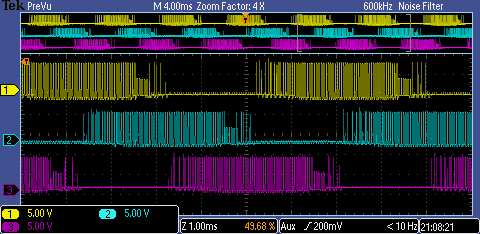
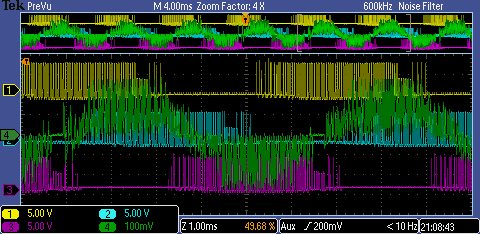

# Kiel_50 - Programmable ESC for the BLDC and PMSM Motors
Kiel 50 is the Arduino UNO shield for driving sensor-less three-phase BLDC motor. The main advantage is the sinusoidal current drive. By monitoring the back-EMF (BEMF) the motor can run without the independent rotor position sensor aka hall sensor or encoder. The chip is able to sense the BEMF from very low rpm up to high rpm. The speed can be set and adjusted using PWM or SPI. The Kiel 50 shield comes with the main chip [A4964](https://www.allegromicro.com/en/Products/Motor-Drivers/BLDC-Drivers/A4964) from "Allegro MicroSystems". This chip is All-in-one: the motor controller, N-Channel MOSFET driver, voltage regulator, MCU watchdog. The ability to program this chip via SPI using Arduino makes it easy to use for many projects. After the configurations were uploaded to the controller and saved to the NVM it can run without Arduino as well.

Measurement of the three-phase (Voltage Ch.1,2,3)

Measurment of the three-phase (Voltage Ch.1,2,3 + Current Ch.4 (GN))

---

## Technical specification
|Characteristic|Symbol|Note|Raiting|Unit|
| --- | --- | --- | --- | --- |
|Supply voltage|Vsup| |5.5 - 50|V|
|Logic voltage|VLR|REG 25 - VLR|3.3 - 5|V|
|Maximal current|Imax|Fused: F2|10|A|
|Maximal logic current|Ilog|Fused: F1|290|mA|
|Gate drive regulator voltage|Vrg|REG 25 - VRG|8 or 11|V|
|Bridge PWM frequency|ƒpw|REG 0 - PW|14.2 - 50|Khz|
|PWM frequency (logic)|ƒpwm||500 - 1000|Hz|
|SPI frequency|ƒspi||2|Mhz|

## Safety features
|Feature|Description|
| --- | --- |
|Undervoltage lockout|Controller can detect the voltgae drop and switsch the motor off. Thus avoiding the risk of unpredictible behavior|
|Peak current limit|Can be programmed using the MCU. Uses shunt for monitoring the current.|
|Ignition switch|The high-active input permitt the system start|
|Bridge MOSFET test|The controller can detect if the driving MOSFETs are broken or have any issues.|
|Windmill detection|If the motor rotetes, the controller can detect its speed and syncronise with it. Thus allowing further rotation without the braiking|  
|MCU watchdog and reset||

## Driving modes
| Mode | Description |
| --- | --- |
| Closed-loop speed | Is used in many e-bike controllers. Acceleration, braking, reaction speed and others settings can be configured via SPI only. After the configuration was set, the speed input via SPI or PWM is acceptable. |
| Closed-loop current | The configuration is done via SPI only. The speed can be adjusted using SPI or PWM | 
| Open-loop speed | The motor starts in open-loop speed aka start ramp. |

---

# How to start

### Hardware for the first start
- Kiel_50 board
- Three phase BLDC motor
- Arduino UNO
- Power supply 5.5V - 50V with at least 1A (for small motors)
- Main PC for programming

### Software for the first start
- Arduino IDE
- The Software for the Arduino UNO 

### Folow this tutorial
1. First git clone the repository or download it to the main PC.
2. Navigate to the folder Kiel_50.
3. Open /Kiel_50/Software/chip_test/chip_test_programm.ino file in Arduino IDE.
4. Select Arduoino UNO in the Borard manger and compile the chip_test_programm.ino.
5. By setting all switches on SW_DIP_x04(BLUE) to ON you enable the SPI communication with Arduino UNO.
6. Plug the Kiel 50 shield to Arduino UNO.
7. Flash Arduino UNO.
8. Connect the power supply to the board.
9. Open the sirial monitor, now you can monitor the supply voltage, chip temperatur, current

---
### Keywords:
- ESC - electric speed controller
- BLDC - Brushless DC electric motor
- PMSM - Permanent magnet synchronous motor
- DC - Direct current
- IDE - Integrated Development Environment
---

# Notes:
#### Aplication example: 
1. Free rotating motors
2. Pump 
3. Fans and blowers

#### Hardware design features: 
1. Min component size 0802 SMD for easy hand soldering.
2. Radiator for the heat dissipation from the IC.
